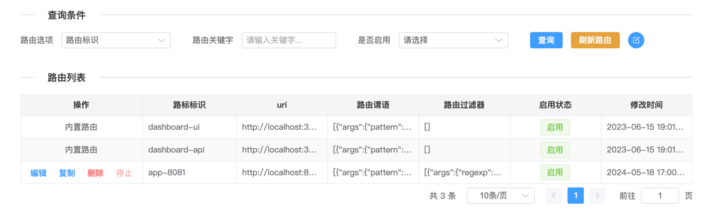
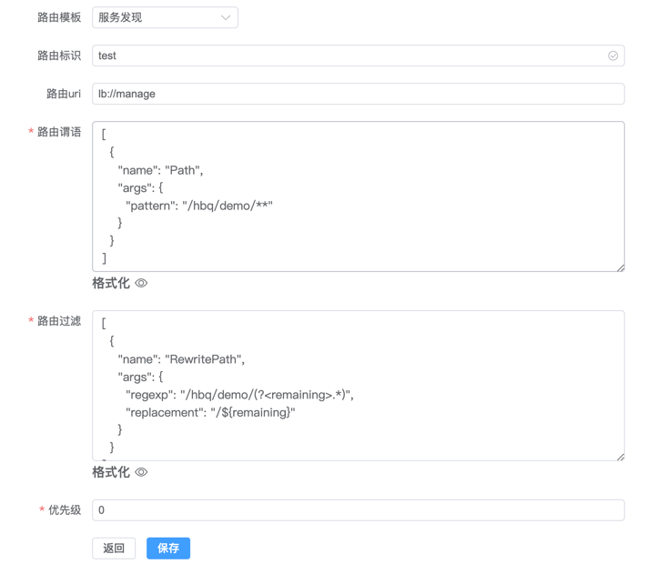

# 用户指南


## 1. 构建

1. 构架控制台UI

```bash
cd api-gateway/api-gateway-manage/src/main/resources/static
nvm use 20
npm install
npm run build
```


2. 构建gateway

```bash
cd api-gateway
mvn -Dmaven.test.skip=true clean package -U
```


## 2. 部署运行

1. 本地部署

```bash
cd api-gateway-dist/target
tar xvf api-gateway-dist-1.0.tar.gz
cd api-gateway-dist-1.0/deploy/local
sh bootstrap.sh
```


2. 容器化部署

```bash
cd api-gateway-dist/target/api-gateway-dist-1.0/deploy/docker
sh build.sh
sh push.sh
cd api-gateway-dist/target/api-gateway-dist-1.0/deploy/kubernetes
sh apply.sh
```


## 2.Dashboard


- 访问链接

http://localhost:30139/ui-gw/index.html


- 控制台页面





