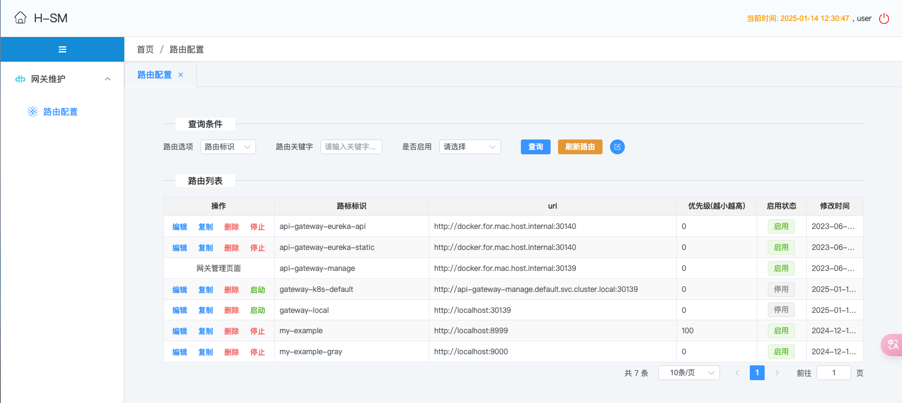
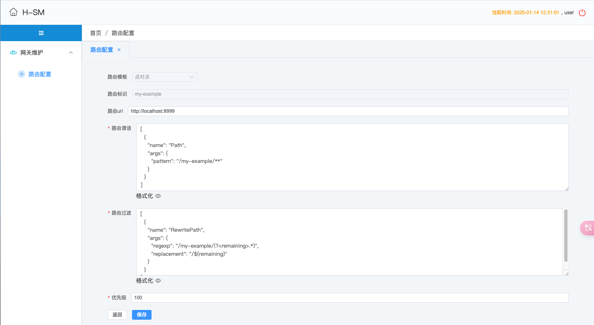

## 快速开始 (Quick Start)

## 构建 (Build)

Step 1: Build UI

```bash
cd api-gateway/api-gateway-manage/src/main/resources/static
nvm use 20
npm install
npm run build
```


Step 2: Build gateway

```bash
cd api-gateway
mvn -Dmaven.test.skip=true clean package -U
```


## 部署运行 (Deployment and Run)

### 本地部署 (Local Deployment)

```bash
cd api-gateway-dist/target
tar xvf api-gateway-dist-1.0.tar.gz
cd api-gateway-dist-1.0/deploy/local
sh bootstrap.sh
```


### 容器化部署 (Containerized Deployment)

```bash
cd api-gateway-dist/target/api-gateway-dist-1.0/deploy/docker
sh build.sh
sh push.sh
cd api-gateway-dist/target/api-gateway-dist-1.0/deploy/kubernetes
sh apply.sh
```


## 控制台 (Dashboard)


http://localhost:30139/hbq969-sm/index.html

user/123456








## 许可 (License)

The MIT License (MIT)

Copyright (c) 2024 hbq969

Permission is hereby granted, free of charge, to any person obtaining a copy of
this software and associated documentation files (the "Software"), to deal in
the Software without restriction, including without limitation the rights to
use, copy, modify, merge, publish, distribute, sublicense, and/or sell copies of
the Software, and to permit persons to whom the Software is furnished to do so,
subject to the following conditions:

The above copyright notice and this permission notice shall be included in all
copies or substantial portions of the Software.

THE SOFTWARE IS PROVIDED "AS IS", WITHOUT WARRANTY OF ANY KIND, EXPRESS OR
IMPLIED, INCLUDING BUT NOT LIMITED TO THE WARRANTIES OF MERCHANTABILITY, FITNESS
FOR A PARTICULAR PURPOSE AND NONINFRINGEMENT. IN NO EVENT SHALL THE AUTHORS OR
COPYRIGHT HOLDERS BE LIABLE FOR ANY CLAIM, DAMAGES OR OTHER LIABILITY, WHETHER
IN AN ACTION OF CONTRACT, TORT OR OTHERWISE, ARISING FROM, OUT OF OR IN
CONNECTION WITH THE SOFTWARE OR THE USE OR OTHER DEALINGS IN THE SOFTWARE.